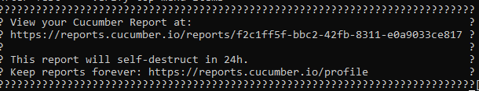
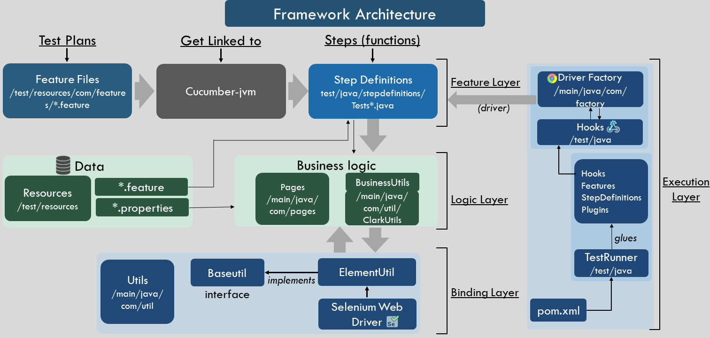

# QA Assignment submitted by **Saurabh Piyush**
This repo contains the UI automation cases that were developed as part of the assignment, to qualify for the post of QE Engineer at Clark

## Index
1. [Framework](#Framework)
2. [Run the Automation Suite](#Run-the-Automation-Suite)
    1. [Method A Through Code Repo](#Windows-Through-code-Repo)
    2. [Method B Through Runnable Jar](#Windows-Through-Runnable-Jar)
    3. [Method C Through Runnable Jar - Mac](#Mac-Through-Runnable-Jar)
3. [Framework Architecture](#Framework-Architecture)
4. [Why this framework?](#Why-this-framework?)
5. [Contact](#Contact)

## **Framework**
For this assignment, I used Cucumber tool based on java test automation framework suite. It supports Behavior-driven development (BDD) framework  approach with its ordinary language parser called Gherkin. The test cases are stored in the feature files in a logical language that customers can understand. It comprises of the following properties:
- **Cucumber-java** (for writing test plans in BDD format)
- **Cucumber-junit** (unit testing framework for executing test plans)
- **Maven** ( project management /  build automation tool)
- **POM** ( Page Object Model; a design pattern)
- **Selenium-webdriver** (to automate UI and saving failed scenarios screenshots)
- **Cucumber Reports Service** (for reporting)

### **Run the Automation Suite**
First you need to clone the repo to your local

- Clone with HTTPS:     
    `git clone https://github.com/saurabhpiyush1187/clarkautomation.git`

Then you need to follow either of the below methods
#### **Method A**: Windows Through code Repo
**Requirements**

- Java 8
- Maven
- Chrome

Open the command line and point it to the directory of the repo on your system and execute following command.
    
      mvn clean
      mvn compile
      mvn test

That's it.

This will start the execution of the test cases.

**View HTML Report**

      pretty plugin

Above plugin has been used  for reporting. The report can be viewed in one of the following locations.

>target/cucumber-reports/report.html

>test-output/SparkReport {Date and Time}

OR

You can copy the Cucumber report link from the command line console.

#### **Method B**: Windows Through Runnable Jar
If you simply want to run the suite without knowing about the mechanics of it, just executing runnable jar file would be sufficient.

Requirements
- Java 8
- Chrome

Please follow the steps below:

1. **Open the terminal and point it to the directory of the repo on your system**
    
2. **Execute the following commands**

            execute.bat            
This will start the execution of all the test cases.

The report can be viewed in one of the following locations.

>target/cucumber-reports/report.html

#### **Method C**: Mac Through Runnable Jar
If you simply want to run the suite without knowing about the mechanics of it, just executing runnable jar file would be sufficient.

Requirements
- Java 8
- Chrome

Please follow the steps below:

1. **Open the terminal and point it to the directory of the repo on your system**
    
2. **Execute the following commands**

            java -jar clarkRunnable.jar           

This will start the execution of all the test cases.
  
The report can be viewed in one of the following locations.

>target/cucumber-reports/report.html

## **Framework Architecture**

## **Why this framework?**

- **Use of OOPS concepts**
   With the usage of OOPS concepts we can leverage its advantages of Data Security, Data Redundancy, Re-usability, Polymorphism Flexibility, etc.
   
   
- **Bridging the gap between Product Owner and QA**
   With the test plan is written plain english in BDD format, it acts as a layer between the acceptance criteria and the automation code. The test plans are easy to understand and written almost in the way the Product Owner writes writes the user stories.
   
 
  
- **Bridging the gap between Manual QA and automation code**
    When a user story comes to test, the first step is that we create test plans then test the functionality and then move to automation once it is stable enough to automate. Usually, QA ends up creating two test plans, one for manual QA execution and other for automation.
  

- **Command line execution**
    Maven provides several options to run tests from the command line making it easy to integrate it with the CI/CD tools like Jenkins.

- **WebDriver Manager**
    In order to run our selenium webdriver automation scripts on chrome/firefox browsers, we have to download the binary/.exe files like Chromedriver.exe and geckodriver.exe manually.
    Webdrivermanager helps to download binanries/executables in an automated way. It checks the browser version installed on your machine and the version of the driver. It downloads the WebDriver binary executable if it is not present in the WebDriverManager cache in the Maven repository (~/.m2/repository/webdriver by default) and exports the appropriate WebDriver Java environment variables required by Selenium

    

## **Contact**
Let me know if you would like to know more about the architecture or have any feedback. I would like to talk more about the framework suite and architecture in detail.

With best regards,

Saurabh

